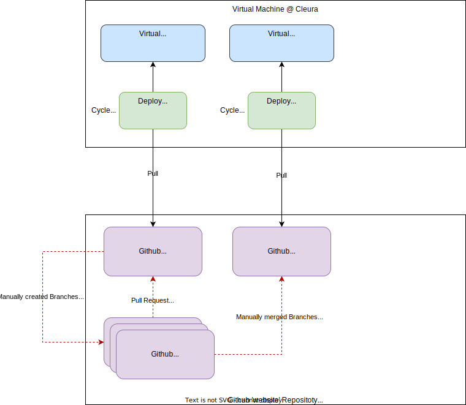

# The SCS website project

The static [SCS website](https://scs.community) is generated by [Jekyll](https://jekyllrb.com/). The theme is originally based on the template [business-frontpage](https://github.com/sharu725/business-frontpage) by [sharu725](https://github.com/sharu725). We're heavily making use of [Bootstrap 5](https://getbootstrap.com/docs/5.0) to layout the page content.

The website is automatically build every 15 minutes or on every push to `main` and subsequently pulled onto our webspace.

## Locations

Orientation for newbies:

* [Place for adding further employees](https://github.com/SovereignCloudStack/website/tree/main/_employees)
* [Place for adding further community profiles](https://github.com/SovereignCloudStack/website/tree/main/_members)
* [Place for adding further partners](https://github.com/SovereignCloudStack/website/tree/main/_partners)
* [Place for adding further supporting partners](https://github.com/SovereignCloudStack/website/blob/main/_data/supporter.yml)
* [Place for adding further providers](https://github.com/SovereignCloudStack/website/blob/main/_data/provider.yml)

Published sites:

* [The productive SCS site](https://scs.community/)
* [The staging area](https://staging.scs.community/)

## The basic editorial workflow

The website data is deployed by the following process:



The following steps describe the basic workflow how to add, change and remove content.
The description is a little more detailed than it needs to be, as it aims also to provide a reliable guide for non-engineer colleagues.

1. Create a branch based on the `main` branch
   (you can also do this using the github user interface)
   ```
   git clone git@github.com:SovereignCloudStack/website.git # you only only the fist time
   cd website
   git checkout main
   git pull
   git checkout -b feat/<name of your branch> # not not use spaces
   ``` 
2. Make your changes with the tool of your choice
   <details>
   <summary>Example: Edit content with Visual Studio Code (use what you like the most)</summary>
     - Download and install [Visual Studio Code](https://code.visualstudio.com/) Development Environment on your workstation
     - Install the [Markdown All in One](https://marketplace.visualstudio.com/items?itemName=yzhang.markdown-all-in-one) Extension
       - Preferences -> Extensions
     - Add search extension: "Markdown All in One"
     - Add spellcheck extension "Code Spell Checker"
     - Select the extension and hit the button "Install"
   - Open the `website` folder with Visual Studio Code
   - Open files for editing and use the preview folder
  </details>

1. Commit and push with signoffs
   ```
   git status
   git diff
   git add <file> ... <file>
   git status
   git commit -s -a
   gut push 
   ```
2. Optional: Testing complexer changes
  * Set the `staging` branch to the same state like the main branch
     ```
     git checkout staging
     # check the current difference
     git diff main
     git reset --hard origin/main
     # add changes of other branches
     git merge feat/<name of your branch>
     git merge feat/<name of your branch ... >

     # perform a hard overwrite of everything in the staging branch
     git push --force
     ``` 
  * Test the result: https://staging.scs.community/ (that takes ~15minutes)
  * Start at Step 2 if your are not satisfied
3. Create a pull request to get the changes in the `main` branch
   * Open https://github.com/SovereignCloudStack/website
   * Select `Contribute` -> `Open pull request`
     * Verify that `base: main` and `compare <your branch>` is selected in the top of the pull request
     * Add a optional description
     * `Create pull request` 
   * Assign one ore more persons which can review the changes and remind the person to review the change
4. The [reviewer](https://github.com/pulls/assigned) inspects [your](https://github.com/pulls) changes and gives feedback
   * If there is something to todo, you can restart at step 2
   * If everything is fine the reviewer approves the merge request
   * Your changes are merged to the `main` branch and rolled out after 15 minutes

## Frequently asked questions

### How can I publish a community blog posting?
Create a markup document located at `_i18n/en/blog` and/or respectively `_i18n/de/blog`  to add a new blog post. Be aware that the file shall be named `YEAR-MONTH-DAY-title.MARKUP` according to the Jekyll conventions (see [Jekyll Docs](https://jekyllrb.com/docs/posts/)).

### How can I create a new page?
Due to the internalization plugin, you have to create multiple files. First of all, add a new markup document under `_pages`, set the desired layout, e.g. `default` and add the line
```

```
Following this step, you have to create the documents `pagetitle.MARKUP` located at `_i18n/en` and `_i18n/de`. Note that you have to create at least the English translation or otherwise the build process will fail.

### How can I add a press release?
Add the press release to `_data/news_de.yml` for German speaking press release or `_data/news_en.yml` for English speaking releases.

### How can I add a new partner?
Upload the logo to `assets/images` and add a entry in `_data/supporter.yml`

### How can I add custom styling definitions (CSS code)?
As we're using Bootstrap, please add your custom styling definitions to `assets/css/_sass/custom.css`

