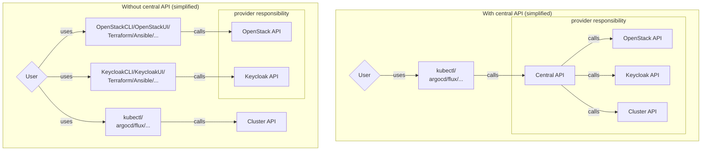

## The SCS Central API is available as a Technical Preview now

As of now, a numerous cloud offerings are available. There are the large hyperscalers like GCP, AWS, or Azure and also smaller Cloud Service Providers. Each of them offer a unique collection of services build on different technologies. Some technologies are proprietary, other is open source. How to choose the right cloud for the project to build? What are the important key features a Cloud offering should provide? There are many dimensions to look at, like pricing, data protection and sovereignity, security, along with many other. But there is one aspect that is especially important for the engineers to use a cloud, which is the Usability Experience.

In order to work efficiently with a cloud, especially on a public cloud (but not limited to it), DevOps and cloud engineers need to be able to provision and manage cloud resources in an easy way and via self service. Usually, this is done by some kind of WebUI like a Portal or via API Calls to the Cloud Provider backend. Those APIs are typically used by CLI tools either native to the cloud like Azure-CLI on Azure or Hetzners `hcloud` CLI or Infrastructure as Code (IaC) tools like OpenTofu or Ansible.

The Sovereign Cloud Stack (SCS) builds on Open Source Software and community-developed standards to provide the tools to build a digital sovereign and interoperable cloud. Users of an SCS-compatible or SCS-certifified cloud should be able to move workload from one SCS cloud to another with minimal effort due to the common standards. The SCS Reference Implementation is an opinionated Cloud Stack fullfilling all standards and can be used to build a sovereign cloud. The Reference implemenation uses different software and tools to build different aspects of a cloud. The Infrastructure as a Service (IaaS) Layer is build with OpenStack, Kubernetes as a Service (KaaS) is build with the Cluster Stacks (developed by the SCS Community, build on ClusterAPI), and Identity and Access Management (IAM) is done with KeyCloak. All those tools are well tested and integrated, but DevOps Teams need to use several APIs to use all tools. There is the OpenStack API for managing networks, virtual machines, and other IaaS ressources. Users, Roles and User-Federation is done with KeyCloak specific APIs. Finally, managed Kubernetes Clusters are managed by ClusterStacks with uses a Kubernetes API to manage those clusters. We see that we need to leverage at least three different APIs with different methods of Authorizationa and Authentication, using different tooling. Other cloud platforms use a unified API with a unified Authentication and Authorization approach to use all their resources. This is the usability issue, the SCS Central API approach wants to solve.

## What is the SCS Central API

We wanted to build a common interface for cloud endusers to manage their infrastructure centrally with one API. This is a huge task when compared to already existing solutions from other clouds. As we face multiple complex APIs we need to unify, like OpenStack and KeyCloak, abstracting everything would be a challenging task. We identified several problems we need to solve which a basically: Authentication, Authorization, Multi-Tenancy, and the notion of resources. The first two, we already mentioned before. Multi-Tenancy is of utmost importance as a single Central API Instance should be available to all users of a cloud and a tenant should not interfer with resources of another tenant in any way. The notion of resources is the last important issue as the user experience should be uniform and requests to the Central API should feel the same regardless of deploying a VM or creating a Kuberetes Cluster. We discussed several approaches on how to build such an interface.

1. Building a Restful API with a Web Framework
2. Extending the OpenStack API with a custom OpenStack Driver
3. Building ontop of the Kubernetes API

Building a Central API as a new Restful API would offer most freedom on designing the API. The problem would be that we would reinventing some wheels along the way as all expects need to be created. In the SCS Project, we strive to use upstream components are strengthen upstream projects by not only using their work, but to contribute and upstream our work to make it available for others to use. Creating a new service would contradict this approach and would lead to a huge effort creating the resource definitions, implementing Authorization and Authorization. Building an own Multi-Tenancy aproach would also be complicated as this would be security relevant and needed to be audited.

Using the OpenStack API as the chosen standard would be a viable approach to manage Kubernetes Clusters and other resources as projects like Magnum show. The SCS Project's [technological vision](https://scs.community/about/#technological-vision) does not see OpenStack as the primary service and we want to avoid vendor lock-ins as far as possible. So this approach was also dismissed.

The third approach is using the Kubernetes API as the Central API. This would solve some issues right from the start as already existing concepts of Kubernets could be used off the shelve like Authentication and Authorization with Kubernetes RBAC. Using Kubernetes also gives us huge and generic ecosystem. The Kubernetes API comes with an built-in notion of resources. Resources have a Kind, Metadata and a Spec and can be defined as Custom Resources. Multi-Tenancy can be achived by using Namespaces. Together with using the Kubernetes API we choose to also leverage [Crossplane](https://www.crossplane.io/), which is a Platform Engineering tool. It is used to provision cloud resources by using Kubernetes nativ resources. The Platform Team creates so called Crossplane Resource Definitions (XRDs) which creates Compositions and Claims. Compositions are templated mananged resources, which are in turn Kubernetes resources descibing real cloud resources outside of the Kubernetes Cluster. Those resources are cluster scoped. Claims on the other hand are namespaced and are used by a team, or in our case a tenant, to manage their cloud resources. This way, tenant resources are isolated and multi-tenancy is achieved.

The following tables summerizes the different aproaches and efforts.

| Resource Models/Patterns | API Backend | AuthN | AuthZ | Multi-tenancy |
| -------- | -------- | --- | --- | ---- |
| Selfdefined API's | Selfmade REST server | Selfmade | Selfmade | Selfmade |
| OpenStack API's | Selfmade REST server? | Keystone Integration? | Keystone Integration? | Keystone Integration? |
| Kubernetes/Crossplane API | Kubernetes apiserver | Kubernetes apiserver AuthN | Kubernetes RBAC | Crossplane namespacing |

| Resource Models/Patterns | Amount of base work | Amount of work per resource | Ease of adoption / ecosystem | Scalability |
| -------- | -------- | --- | --- | --- |
| Selfdefined API's | Unknown, depends on tech stack | Unknown (Maybe Low if utilizing `fog`/...) | No ecosystem| Good, depending on architecture |
| OpenStack API's | Unknown | Unknown (Maybe Low if utilizing `fog`/...) | Good for existing API's, bad for others | Good, probably |
| Kubernetes/Crossplane API | Low, utilizing existing concepts | Low due to existing Crossplane providers | Great, due to huge, generic ecosystem for any resource | Alright (scale with namespaces or clusters) |

## What is the current status of the Central API

As of now, we build a first technical preview that is capable of managing OpenStack Resources as well as creating Kubernetes Clusters with ClusterStacks as well as Gardener. For OpenStack resources we used the upstream OpenStack Crossplane Provider as it gives us control over a numerous amount of OpenStack resources. These are not feature complete but resources a user commonly would use are present and usable. A Cloud Service Provider need to set up the the OpenStack credentials for a tenant namespace. The SCS XRD are mirrored from the OpenStack Provider and are already bundled as a Crossplane package to be used.

For managing Kubernetes Clusters, we used the Crossplane Kubernetes Provider to create Manifests on remote Kubernetes Clusters. The XRDs created will create the Compositions and Claims to create ClusterStack Manifests on a ClusterAPI Management Cluster. Hence, a user will be able to use such a Claim to trigger the creation and deletion of such ClusterAPI Clusters. Additionally, we created such an XRD to also support Gardener Clusters by creating Gardener Shoot Manifests on Gardener Clusters. Currently, it is only possible to set the Kubernetes Version in the Claim Resource, but it proves that it is possible to have manage all those Cloud resources over a single API that is open source and leverages upstream work.

## The Future of the Central API

As mentioned before, the only option for Kubernetes Clusters are currently the used Kubernetes Version along with a name. This can be extended and standardized in the future to also support other important options like Node Pools and other aspects. We are also lacking the support for managing Keycloak settings for now, but there is a Keycloak Crossplane Provider available for doing so.

## Get Involved!

Now, this is a *technical preview*, so not all work we want to be included in our first full release is currently done.

However, we think our implementation is far along enough to be handed over to you, to experiment with it and hopefully provide us with some feedback on how we are doing.
If you want to get involved, please check out our [Repository](https://github.com/SovereignCloudStack/central-api) and try our the SCS Central API.
